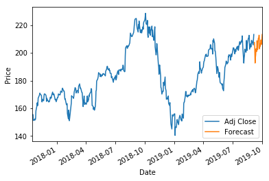
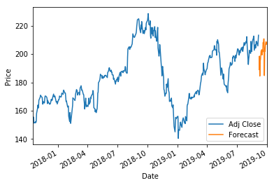
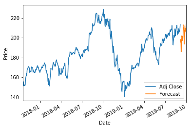
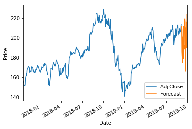

# Stock Trading Predictions Using AAPL as an example

## 1. Loading YahooFinance Dataset  

## 2. Exploring Rolling Mean and Return Rate of Stocks 

## 3. Feature Engineering

## 4. Pre-processing & Cross Validation

## 5. Model Generation 

## 6. Plotting the Prediction


```python
import pandas as pd
import datetime
import pandas_datareader.data as web
from pandas.plotting import scatter_matrix
from pandas import Series, DataFrame
```


```python
import math

start = datetime.datetime(2009, 12, 31)
# end = datetime.datetime(2017, 1, 11)
end = datetime.datetime.now()
df = web.DataReader("AAPL", 'yahoo', start, end)
df.tail()
```


<div>
<style scoped>
    .dataframe tbody tr th:only-of-type {
        vertical-align: middle;
    }

    .dataframe tbody tr th {
        vertical-align: top;
    }
    
    .dataframe thead th {
        text-align: right;
    }
</style>
<table border="1" class="dataframe">
  <thead>
    <tr style="text-align: right;">
      <th></th>
      <th>High</th>
      <th>Low</th>
      <th>Open</th>
      <th>Close</th>
      <th>Volume</th>
      <th>Adj Close</th>
    </tr>
    <tr>
      <th>Date</th>
      <th></th>
      <th></th>
      <th></th>
      <th></th>
      <th></th>
      <th></th>
    </tr>
  </thead>
  <tbody>
    <tr>
      <th>2019-08-29</th>
      <td>209.320007</td>
      <td>206.660004</td>
      <td>208.500000</td>
      <td>209.009995</td>
      <td>20990500.0</td>
      <td>209.009995</td>
    </tr>
    <tr>
      <th>2019-08-30</th>
      <td>210.449997</td>
      <td>207.199997</td>
      <td>210.160004</td>
      <td>208.740005</td>
      <td>21143400.0</td>
      <td>208.740005</td>
    </tr>
    <tr>
      <th>2019-09-03</th>
      <td>206.979996</td>
      <td>204.220001</td>
      <td>206.429993</td>
      <td>205.699997</td>
      <td>20023000.0</td>
      <td>205.699997</td>
    </tr>
    <tr>
      <th>2019-09-04</th>
      <td>209.479996</td>
      <td>207.320007</td>
      <td>208.389999</td>
      <td>209.190002</td>
      <td>19188100.0</td>
      <td>209.190002</td>
    </tr>
    <tr>
      <th>2019-09-05</th>
      <td>213.960007</td>
      <td>211.509995</td>
      <td>212.000000</td>
      <td>213.279999</td>
      <td>23946984.0</td>
      <td>213.279999</td>
    </tr>
  </tbody>
</table>
</div>


```python
dfreg = df.loc[:,['Adj Close','Volume']]
dfreg['HL_PCT'] = (df['High'] - df['Low']) / df['Close'] * 100.0
dfreg['PCT_change'] = (df['Close'] - df['Open']) / df['Open'] * 100.0
dfreg.head()
```


<div>
<style scoped>
    .dataframe tbody tr th:only-of-type {
        vertical-align: middle;
    }

    .dataframe tbody tr th {
        vertical-align: top;
    }
    
    .dataframe thead th {
        text-align: right;
    }
</style>
<table border="1" class="dataframe">
  <thead>
    <tr style="text-align: right;">
      <th></th>
      <th>Adj Close</th>
      <th>Volume</th>
      <th>HL_PCT</th>
      <th>PCT_change</th>
    </tr>
    <tr>
      <th>Date</th>
      <th></th>
      <th></th>
      <th></th>
      <th></th>
    </tr>
  </thead>
  <tbody>
    <tr>
      <th>2009-12-31</th>
      <td>26.272409</td>
      <td>88102700.0</td>
      <td>1.323968</td>
      <td>-1.126074</td>
    </tr>
    <tr>
      <th>2010-01-04</th>
      <td>26.681330</td>
      <td>123432400.0</td>
      <td>0.990606</td>
      <td>0.271752</td>
    </tr>
    <tr>
      <th>2010-01-05</th>
      <td>26.727465</td>
      <td>150476200.0</td>
      <td>1.091520</td>
      <td>-0.102519</td>
    </tr>
    <tr>
      <th>2010-01-06</th>
      <td>26.302330</td>
      <td>138040000.0</td>
      <td>2.123523</td>
      <td>-1.590633</td>
    </tr>
    <tr>
      <th>2010-01-07</th>
      <td>26.253704</td>
      <td>119282800.0</td>
      <td>1.400893</td>
      <td>-0.552538</td>
    </tr>
  </tbody>
</table>
</div>


```python
import math
import numpy as np
from sklearn import preprocessing, svm
from sklearn.model_selection import cross_validate
from sklearn.model_selection import train_test_split


# Drop missing value
dfreg.fillna(value=-99999, inplace=True)

print(dfreg.shape)
# We want to separate 1 percent of the data to forecast
forecast_out = int(math.ceil(0.01 * len(dfreg)))

# Separating the label here, we want to predict the AdjClose
forecast_col = 'Adj Close'
dfreg['label'] = dfreg[forecast_col].shift(-forecast_out)
X = np.array(dfreg.drop(['label'], 1))

# Scale the X so that everyone can have the same distribution for linear regression
X = preprocessing.scale(X)

# Finally We want to find Data Series of late X and early X (train) for model generation and evaluation
X_lately = X[-forecast_out:]
X = X[:-forecast_out]

# Separate label and identify it as y
y = np.array(dfreg['label'])
y = y[:-forecast_out]

print('Dimension of X',X.shape)
print('Dimension of y',y.shape)

X_train, X_test, y_train, y_test = train_test_split(X, y, test_size=0.2)
```

    (2436, 4)
    Dimension of X (2411, 4)
    Dimension of y (2411,)


```python

from sklearn.linear_model import LinearRegression
from sklearn.linear_model import Ridge
from sklearn.preprocessing import PolynomialFeatures
from sklearn.pipeline import make_pipeline
from sklearn.neighbors import KNeighborsRegressor
from sklearn.linear_model import Lasso

import matplotlib.pyplot as plt

```


```python

# Linear regression
clfreg = LinearRegression(n_jobs=-1)
clfreg.fit(X_train, y_train)

# Quadratic Regression 2
clfpoly2 = make_pipeline(PolynomialFeatures(2), Ridge())
clfpoly2.fit(X_train, y_train)

# Quadratic Regression 3
clfpoly3 = make_pipeline(PolynomialFeatures(3), Ridge())
clfpoly3.fit(X_train, y_train)
    
# KNN Regression
clfknn = KNeighborsRegressor(n_neighbors=2)
clfknn.fit(X_train, y_train)

# Lasso regression
clflasso=Lasso()
clflasso.fit(X, y)

confidencereg = clfreg.score(X_test, y_test)
confidencepoly2 = clfpoly2.score(X_test,y_test)
confidencepoly3 = clfpoly3.score(X_test,y_test)
confidencelasso= clflasso.score(X_test, y_test)
confidenceknn = clfknn.score(X_test, y_test)

print("The linear regression confidence is ",confidencereg)
print("The quadratic regression 2 confidence is ",confidencepoly2)
print("The quadratic regression 3 confidence is ",confidencepoly3)
print("The lasso regression confidence is ",confidencelasso)
print("The knn regression confidence is ",confidenceknn)
```

    The linear regression confidence is  0.9667627040877486
    The quadratic regression 2 confidence is  0.9654763605644529
    The quadratic regression 3 confidence is  0.9392181555079536
    The lasso regression confidence is  0.9667580759695565
    The knn regression confidence is  0.9544867885614678


```python
# # Printing the forecast
# forecast_set = clfreg.predict(X_lately)
# dfreg['Forecast'] = np.nan

# last_date = dfreg.iloc[-1].name
# last_unix = last_date
# next_unix = last_unix + datetime.timedelta(days=1)

# for i in forecast_set:
#     next_date = next_unix
#     next_unix += datetime.timedelta(days=1)
#     dfreg.lnext_dateoc[next_date] = [np.nan for _ in range(len(dfreg.columns)-1)]+[i]

# dfreg['Adj Close'].tail(500).plot()
# dfreg['Forecast'].tail(500).plot()
# plt.legend(loc=4)
# plt.xlabel('Date')
# plt.ylabel('Price')
# plt.show()
```


```python
def forecast( df, forecast_set):
    
#     next_unix = 0
    df['Forecast'] = np.nan
    next_unix = df.iloc[-1].name + datetime.timedelta(days=1)

    for i in forecast_set:
        next_unix += datetime.timedelta(days=1)
        df.loc[next_unix] = [np.nan for _ in range(len(df.columns)-1)]+[i]
    
    return df
```


```python
print("The linear regression confidence is ",confidencereg)

df_clfreg = forecast(dfreg, clfreg.predict(X_lately))
df_clfreg['Adj Close'].tail(500).plot()
df_clfreg['Forecast'].tail(500).plot()
plt.legend(loc=4)
plt.xlabel('Date')
plt.ylabel('Price')
plt.show()

```

    The linear regression confidence is  0.9742304212238455





```python
 
print("The lasso regression confidence is ",confidencelasso)
 

df_clflasso = forecast(dfreg, clflasso.predict(X_lately))

df_clflasso['Adj Close'].tail(500).plot()
df_clflasso['Forecast'].tail(500).plot()
plt.legend(loc=4)
plt.xlabel('Date')
plt.ylabel('Price')
plt.show()
```

    The lasso regression confidence is  0.966541526864036


```python

print("The quadratic regression 3 confidence is ",confidencepoly3)


df_clfpoly3 = forecast(dfreg, clfpoly3.predict(X_lately))


df_clfpoly3['Adj Close'].tail(500).plot()
df_clfpoly3['Forecast'].tail(500).plot()
plt.legend(loc=4)
plt.xlabel('Date')
plt.ylabel('Price')
plt.show()

```

    The quadratic regression 3 confidence is  0.9700190298151962





```python

print("The quadratic regression 2 confidence is ",confidencepoly2)


df_clfpoly2 = forecast(dfreg, clfpoly2.predict(X_lately))

df_clfpoly2['Adj Close'].tail(500).plot()
df_clfpoly2['Forecast'].tail(500).plot()
plt.legend(loc=4)
plt.xlabel('Date')
plt.ylabel('Price')
plt.show()

```

    The quadratic regression 2 confidence is  0.9581613689682223





```python

print("The knn regression confidence is ",confidenceknn)
df_clfknn = forecast(dfreg, clfknn.predict(X_lately))

df_clfknn['Adj Close'].tail(500).plot()
df_clfknn['Forecast'].tail(500).plot()
plt.legend(loc=4)
plt.xlabel('Date')
plt.ylabel('Price')
plt.show()

```

    The knn regression confidence is  0.9544867885614678





```python

```
